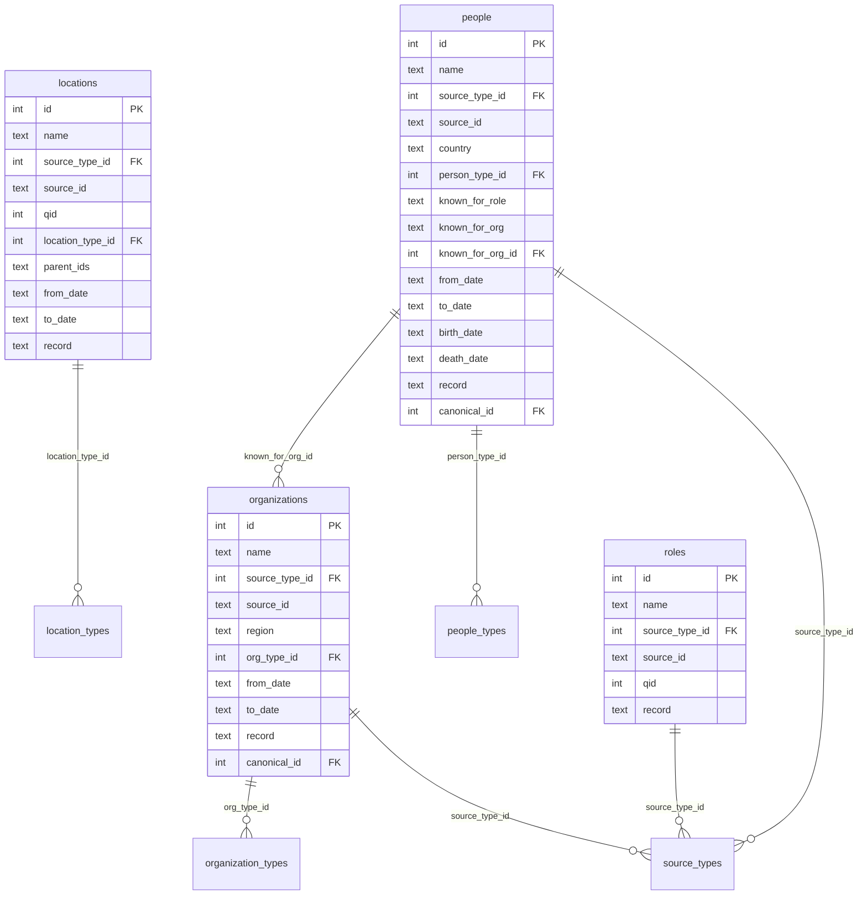

## Database Schema

<span id="database-schema" />

The entity database uses a v3 normalized SQLite schema with integer foreign keys to enum lookup tables, USearch HNSW indexes for fast vector search, and optional float32/int8 embedding tables.

### Schema Overview

<span id="schema-overview" />



### Enum Lookup Tables

<span id="enum-tables" />

The v2/v3 schema uses normalized integer foreign keys instead of TEXT enum values. This reduces storage and speeds up filtering.

**source_types** -- Data provenance:

<table>
  <thead>
    <tr>
      <th>ID</th>
      <th>Name</th>
      <th>Description</th>
    </tr>
  </thead>
  <tbody>
    <tr><td>1</td><td><code>gleif</code></td><td>GLEIF LEI registry (3.2M organizations)</td></tr>
    <tr><td>2</td><td><code>sec_edgar</code></td><td>SEC EDGAR filings (100K+ filers)</td></tr>
    <tr><td>3</td><td><code>companies_house</code></td><td>UK Companies House (5.5M companies)</td></tr>
    <tr><td>4</td><td><code>wikidata</code></td><td>Wikidata/Wikipedia knowledge base</td></tr>
    <tr><td>5</td><td><code>sec_form4</code></td><td>SEC Form 4 insider filings</td></tr>
    <tr><td>6</td><td><code>companies_house_officers</code></td><td>UK Companies House officers dataset</td></tr>
  </tbody>
</table>

**organization_types** -- See the [Entity Types](#entity-types) section for the full list.

**people_types** -- See the [Entity Types](#person-types) section for the full list.

**location_types** -- Simplified categories for filtering:

<table>
  <thead>
    <tr>
      <th>ID</th>
      <th>Name</th>
      <th>Examples</th>
    </tr>
  </thead>
  <tbody>
    <tr><td>1</td><td><code>continent</code></td><td>Europe, Asia, Africa</td></tr>
    <tr><td>2</td><td><code>country</code></td><td>United States, Germany, Japan</td></tr>
    <tr><td>3</td><td><code>subdivision</code></td><td>California, Bavaria, Ontario</td></tr>
    <tr><td>4</td><td><code>city</code></td><td>New York, London, Tokyo</td></tr>
    <tr><td>5</td><td><code>district</code></td><td>Manhattan, Westminster</td></tr>
    <tr><td>6</td><td><code>historic</code></td><td>Soviet Union, Czechoslovakia</td></tr>
    <tr><td>7</td><td><code>other</code></td><td>Unclassified locations</td></tr>
  </tbody>
</table>

### Embedding Storage

<span id="embedding-storage" />

The full database stores embeddings in two formats:

- **Float32 embeddings** (`organization_embeddings`, `person_embeddings`): Full-precision 768-dimensional vectors in SQLite (requires `[build]` extra for sqlite-vec)
- **Int8 scalar embeddings** (`organization_embeddings_scalar`, `person_embeddings_scalar`): Quantized to 8-bit integers for ~75% storage reduction with ~92% recall

The **lite database** drops all embedding tables entirely. Search is performed via USearch HNSW indexes stored as separate `.bin` files.

### USearch HNSW Indexes

<span id="usearch-indexes" />

USearch provides sub-millisecond approximate nearest neighbor search on 50M+ vectors. Index files are co-located with the database:

<table>
  <thead>
    <tr>
      <th>File</th>
      <th>Contents</th>
      <th>Typical Size</th>
    </tr>
  </thead>
  <tbody>
    <tr>
      <td><code>organizations_usearch.bin</code></td>
      <td>Organization embeddings HNSW index</td>
      <td>~3GB (9.7M vectors)</td>
    </tr>
    <tr>
      <td><code>people_usearch.bin</code></td>
      <td>People embeddings HNSW index</td>
      <td>~18GB (63M vectors)</td>
    </tr>
  </tbody>
</table>

**Important**: After loading a USearch index with `Index.restore()`, the `expansion_search` parameter resets to its default (64). For good recall on large indexes, set `expansion_search=200` explicitly after loading.

### Database Variants

<span id="database-variants" />

<table>
  <thead>
    <tr>
      <th>File</th>
      <th>Description</th>
      <th>Use Case</th>
    </tr>
  </thead>
  <tbody>
    <tr>
      <td><code>entities-v3.db</code></td>
      <td>Full database with all embedding tables</td>
      <td>Rebuilding USearch indexes, offline analysis</td>
    </tr>
    <tr>
      <td><code>entities-v3-lite.db</code></td>
      <td>Core fields only (no embedding columns)</td>
      <td>Default download, production search</td>
    </tr>
    <tr>
      <td><code>*_usearch.bin</code></td>
      <td>USearch HNSW indexes</td>
      <td>Required for search (included in download)</td>
    </tr>
  </tbody>
</table>

**Default path**: `~/.cache/corp-extractor/entities-v3.db`

A backwards-compatibility symlink `entities-v2.db` is created automatically on download, pointing to the v3 file.

### Schema Version Metadata

<span id="schema-version" />

The v3 schema includes a `db_info` metadata table:

```sql
CREATE TABLE db_info (
    key   TEXT PRIMARY KEY,
    value TEXT
);

-- Contains:
-- schema_version = '3'
-- created_at     = '2024-...'
```

This allows runtime detection of schema version without relying on filename conventions.
